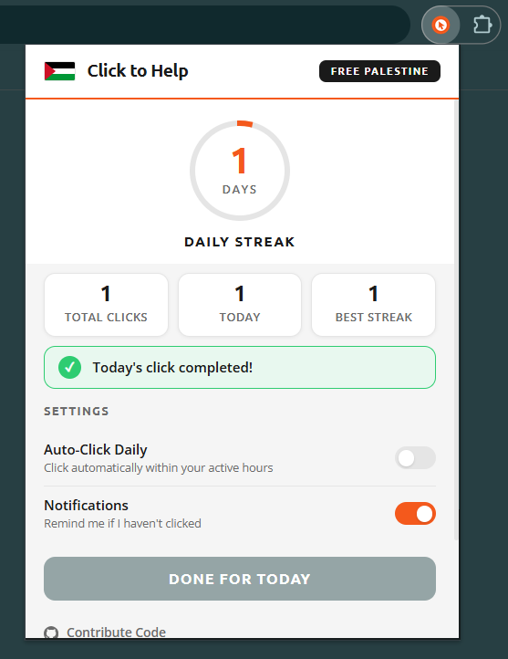

# Click to Help Companion

A browser extension that automates your daily click for Arab.org's Click-to-Help Palestine campaign and keeps track of your streak.

## What this does

Arab.org runs a campaign where one click per day triggers a real donation to Palestine at no cost to you. The problem is remembering to do it every single day. This extension solves that by letting you click directly from the toolbar, tracking your daily streak, and optionally automating the whole thing so you never miss a day.

## Features

- **One-click from the toolbar** - Opens the campaign page and performs the click for you
- **Daily streak tracker** - Visual ring counter that shows how many consecutive days you have clicked
- **Stats dashboard** - Total lifetime clicks, today's status, and your best streak on record
- **Auto-click mode** - Set it and forget it with a random time within your chosen window
- **Reminder notifications** - If you haven't clicked by evening, you get a nudge

## Interface



## Project structure

```
click-to-help-companion/
  manifest.json       Chrome extension manifest (MV3)
  popup.html          Popup UI structure
  popup.css           Styling (flat geometric layout, arab.org color scheme)
  popup.js            Popup logic, streak state, settings
  background.js       Service worker for alarms, auto-click, notifications
  content.js          Content script injected on arab.org to find and click the button
  icons/
    icon-16.png       Toolbar icon
    icon-48.png       Extensions page icon
    icon-128.png      Chrome Web Store icon
```

## Installation

1. Go to `chrome://extensions/`
2. Turn on "Developer mode" in the top right corner
3. Click "Load unpacked"
4. Select the `click-to-help-companion` folder
5. The extension icon should appear in your toolbar

If the icon does not show up, click the puzzle piece icon in the toolbar and pin "Click to Help Companion."

## How the auto-click works

When you enable "Auto-Click Daily" in the settings panel, you can choose a time window. The background service worker picks a random minute within that window and schedules a Chrome alarm. This randomized timing mimics human behavior so the click does not appear as a bot-like fixed schedule.

When the alarm triggers, the extension:

1. Checks if you already clicked today (skips if you did)
2. Opens the arab.org campaign page in a background tab
3. The content script finds the click button on the page and clicks it
4. The tab closes automatically after the click goes through
5. Your streak and stats update

The content script searches for the button using a list of CSS selectors and falls back to scanning button text content. If the button is not found immediately (the page might still be loading), it retries every 2 seconds up to 15 times.

## How the streak works

Your streak increments by 1 each day you click. If you miss a day (more than 24 hours pass between clicks), the streak resets to zero. The ring in the popup fills up as your streak grows, hitting full circle at 30 days.

The extension stores all state in `chrome.storage.local`, so it persists across browser restarts.

## Permissions

- **storage** - Saving your streak, click history, and settings
- **alarms** - Scheduling the daily auto-click and reminder
- **notifications** - Sending you a reminder if you haven't clicked
- **tabs** - Opening the campaign page
- **host_permissions for arab.org** - The content script needs access to the campaign page to find and click the button

## Notes

This is a personal project. It is not affiliated with or endorsed by Arab.org. The campaign URL is `https://arab.org/click-to-help/palestine/` and the extension simply automates visiting that page and clicking the button, the same action you would do manually.

If Arab.org changes their page structure, the content script selectors may need updating. Open an issue or submit a PR if the auto-click stops working.

## License

MIT
